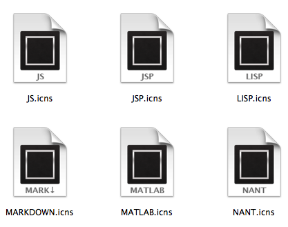

## Credits
[Dan Perrera][4] for creating the [original icon][5] and releasing the PSD file.

## Sample Icons

## Download
From here: http://static.igstan.ro/st2-icons.zip

## Build Your Own
1. open `create-iconsets.jsx` in Photoshop from **File** > **Scripts** > **Browse...**
2. wait for the script to generate the iconsets in the build directory
3. execute `make` (it assumes the `iconutil` executable is installed and on path)
4. the **build** directory will contain the generated "icns" files

## References
- [JavaScript Tools Guide CS5][0] (PDF)
- [Adobe Photoshop CS5 Scripting Guide][1] (PDF)
- [Adobe Photoshop CS5 JavaScript Reference][2] (PDF)
- [Apple's High Resolution Guidelines for OS X][3]

[0]: http://wwwimages.adobe.com/www.adobe.com/content/dam/Adobe/en/devnet/scripting/pdfs/javascript_tools_guide.pdf
[1]: http://wwwimages.adobe.com/www.adobe.com/content/dam/Adobe/en/devnet/photoshop/pdfs/photoshop_cs5_scripting_guide.pdf
[2]: http://wwwimages.adobe.com/www.adobe.com/content/dam/Adobe/en/devnet/photoshop/pdfs/photoshop_cs5_javascript_ref.pdf
[3]: http://developer.apple.com/library/mac/#documentation/GraphicsAnimation/Conceptual/HighResolutionOSX/Optimizing/Optimizing.html#//apple_ref/doc/uid/TP40012302-CH7-SW4
[4]: http://dribbble.com/dperrera
[5]: http://dribbble.com/shots/311515-A-Sublime-Text-2-Icon-that-is-less-horrible
